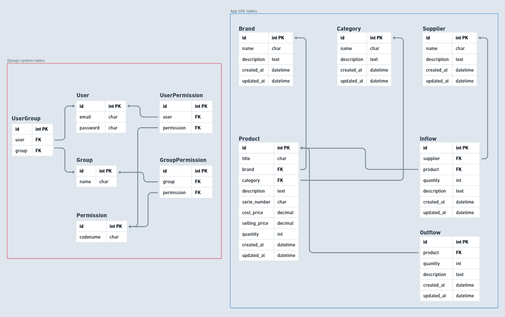
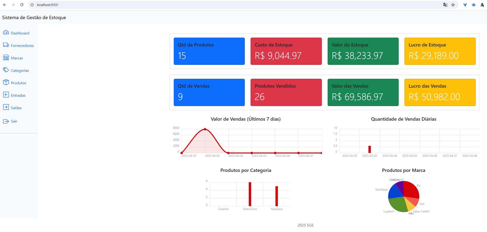
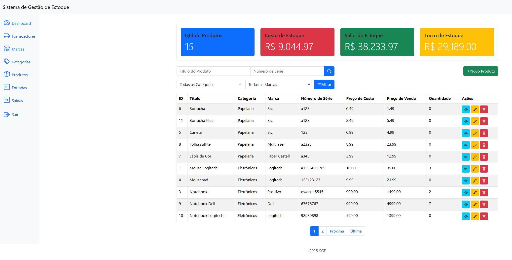

# 📦 Stock Management System

A robust and efficient system for total control of your inventory.

---

## ✨ Functional Requirements

The essential functionalities for managing your stock:

* **➕ Registration:**
    * Products (with details such as name, code, description, cost price, selling price, etc.)
    * Brands
    * Suppliers
    * Categories
    * Product Inflows (with date, quantity, supplier, etc.)
    * Product Outflows (with date, quantity, customer/reason, etc.)

* **🔍 Product Filters:**
    * Advanced search by name, code, brand, category, and other criteria.

* **📊 Automatic Stock Calculation:**
    * Real-time update of the available quantity of each product based on registered inflows and outflows.

* **🔑 Login System:**
    * Secure user authentication for system access.

* **🛡️ Permission Control:**
    * Permission management by user and/or group.
    * Implementation of different access levels to ensure data security and integrity.

* **📈 Dashboards and Metrics:**
    * Intuitive visual panels with key stock metrics.
    * Sales, inflows, outflows, and total stock value charts for a clear view of your business.

* **🔗 Future Integrations Support:**
    * Architecture designed to facilitate future integrations with other systems and automations.

---

# 📦 Stock Management System

A robust and efficient system for total control of your inventory.

---

## ✨ Functional Requirements

The essential functionalities for managing your stock:

* **➕ Registration:**
    * Products (with details such as name, code, description, cost price, selling price, etc.)
    * Brands
    * Suppliers
    * Categories
    * Product Inflows (with date, quantity, supplier, etc.)
    * Product Outflows (with date, quantity, customer/reason, etc.)

* **🔍 Product Filters:**
    * Advanced search by name, code, brand, category, and other criteria.

* **📊 Automatic Stock Calculation:**
    * Real-time update of the available quantity of each product based on registered inflows and outflows.

* **🔑 Login System:**
    * Secure user authentication for system access.

* **🛡️ Permission Control:**
    * Permission management by user and/or group.
    * Implementation of different access levels to ensure data security and integrity.

* **📈 Dashboards and Metrics:**
    * Intuitive visual panels with key stock metrics.
    * Sales, inflows, outflows, and total stock value charts for a clear view of your business.

* **🔗 Future Integrations Support:**
    * Architecture designed to facilitate future integrations with other systems and automations.

---

## ⚙️ Project Installation (Using Docker Compose)

Follow these steps to set up and run the project using Docker Compose. This method containerizes the application and its dependencies for easier management.

---

## 🐳 Prerequisites

Ensure you have Docker and Docker Compose installed on your machine. You can find installation instructions for your operating system on the official Docker website.

---

## 💾 Clone the Repository

1.  Create a directory on your computer where you want to install the project.
2.  Open your command-line terminal or command prompt inside this created directory.
3.  Execute the following command to clone the repository (replace `[REPOSITORY_URL]` with the actual Git repository URL):

    ```bash
    git clone [REPOSITORY_URL]
    cd [YOUR_PROJECT_DIRECTORY]
    ```

---

## 🛠️ Running with Docker Compose

The project is configured to run using Docker Compose. The setup involves a web application container (`sge_web`) and a database container (`sge_db`) running on a shared network (`sge_network`). The web application depends on the database service.

To start the application and the database, run the following command in the project's root directory:

    ```bash
    docker-compose up -d --build
    ```

This command will:

* `-d`: Run the containers in detached mode (in the background).
* `--build`: Build the `sge_web` image if it hasn't been built yet or if the Dockerfile has changed.

---

## 👤 Create Superuser

1.  Create an administrator account to access the Django admin panel:

    ```bash
    docker exec -it <sge_web_container_name_or_id> python manage.py createsuperuser
    ```

    You will be prompted to provide a username, email address, and password for the superuser.

---

## ⚙️ Environment Configuration (.env File)

Before running the application, it's crucial to configure the necessary environment variables. These can be set directly in your Docker environment or, more conveniently, within a `.env` file in the project's root directory, which Docker Compose can then load.

1.  **Rename `.env.copy` to `.env`:** In the project's root directory, you will find a file named `.env.copy`. Rename this file to `.env`.

2.  **Set the Environment Variables:** Open the `.env` file with a text editor. Add or modify the following variables with your specific values:

    ```
    DJANGO_SECRET_KEY=YOUR_DJANGO_SECRET_KEY_HERE
    POSTGRES_USER=YOUR_POSTGRES_USERNAME
    POSTGRES_PASSWORD=YOUR_POSTGRES_PASSWORD
    POSTGRES_DB=YOUR_POSTGRES_DATABASE_NAME
    POSTGRES_HOST=sge_db
    POSTGRES_PORT=5432
    ```

    * **`DJANGO_SECRET_KEY`**: A secret key for your Django application. Replace `YOUR_DJANGO_SECRET_KEY_HERE` with a strong, randomly generated string. **This is critical for the security of your application.**
    * **`POSTGRES_USER`**: The username for your PostgreSQL database. Replace `YOUR_POSTGRES_USERNAME` with the appropriate username.
    * **`POSTGRES_PASSWORD`**: The password for the PostgreSQL user. Replace `YOUR_POSTGRES_PASSWORD` with the correct password.
    * **`POSTGRES_DB`**: The name of the PostgreSQL database to be used. Replace `YOUR_POSTGRES_DATABASE_NAME` with the desired database name.
    * **`POSTGRES_HOST`**: The hostname for the PostgreSQL server. In the Docker Compose setup, this should be `sge_db` as the web container will communicate with the database using the service name.
    * **`POSTGRES_PORT`**: The port number for the PostgreSQL server (default is `5432`).

    **Important:** Do not share your `.env` file or its contents publicly, especially the `DJANGO_SECRET_KEY` and database credentials. Ensure it is added to your `.gitignore` file if you are using Git.

    **Note:** If these environment variables are not correctly configured (either in a `.env` file or directly in your Docker environment), the application will likely fail to connect to the database or will use an insecure default `SECRET_KEY` within Django's `settings.py`. **Using insecure defaults is strongly discouraged for any environment beyond local, temporary development.**

---

Access the System
---

## 🌐 Access the System

1.  Open your web browser.
2.  Navigate to the following address to access the Django admin panel:

    ```bash
    http://localhost:8000/admin
    ```

    Enter the credentials (username and password) you created in the superuser step.

3.  To access the main system, navigate to:

    ```bash
    http://localhost:8000/
    ```

    You should be able to interact with the application using the superuser account.
    
---

## ✅ Access Granted

Congratulations! Your Stock Management System is now running using Docker Compose. You can access the admin panel and the main application in your web browser.

---

## 🗺️ Application Routes

The available URLs to navigate and interact with the system:

### Administrative Pages

* `/admin/`: Django administration panel.
* `/login/`: Login page for system users.
* `/authentication/token/`: Endpoint to obtain a new authentication token.
* `/authentication/token/refresh/`: Endpoint to renew an existing authentication token.
* `/authentication/token/verify/`: Endpoint to verify the validity of an authentication token.
* `/home/`: System homepage after login.

### Brand Management

* `/brands/list/`: List of all brands.
* `/brands/create/`: Form to create a new brand.
* `/brands/<int:pk>/detail/`: Details of a specific brand (replace `<int:pk>` with the brand ID).
* `/brands/<int:pk>/update/`: Form to edit an existing brand.
* `/brands/<int:pk>/delete/`: Confirmation page to delete a brand.

### Category Management

* `/categories/list/`: List of all categories.
* `/categories/create/`: Form to create a new category.
* `/categories/<int:pk>/detail/`: Details of a specific category (replace `<int:pk>` with the category ID).
* `/categories/<int:pk>/update/`: Form to edit an existing category.
* `/categories/<int:pk>/delete/`: Confirmation page to delete a category.

### Inflow Management

* `/inflows/list/`: List of all product inflows.
* `/inflows/create/`: Form to register a new product inflow.
* `/inflows/<int:pk>/detail/`: Details of a specific inflow (replace `<int:pk>` with the inflow ID).

### Outflow Management

* `/outflows/list/`: List of all product outflows.
* `/outflows/<int:pk>/detail/`: Details of a specific outflow (replace `<int:pk>` with the outflow ID).

### Product Management

* `/products/list/`: List of all products.
* `/products/create/`: Form to create a new product.
* `/products/<int:pk>/detail/`: Details of a specific product (replace `<int:pk>` with the product ID).
* `/products/<int:pk>/update/`: Form to edit an existing product.
* `/products/<int:pk>/delete/`: Confirmation page to delete a product.

### Supplier Management

* `/suppliers/list/`: List of all suppliers.
* `/suppliers/create/`: Form to create a new supplier.
* `/suppliers/<int:pk>/detail/`: Details of a specific supplier (replace `<int:pk>` with the supplier ID).
* `/suppliers/<int:pk>/update/`: Form to edit an existing supplier.
* `/suppliers/<int:pk>/delete/`: Confirmation page to delete a supplier.

### RESTful API (Version 1)

#### Brands

* `/api/v1/brands/`: Endpoint to list and create brands (GET and POST methods).
* `/api/v1/brands/<int:pk>/`: Endpoint to retrieve, update, and delete a specific brand (GET, PUT, and DELETE methods).

#### Categories

* `/api/v1/categories/`: Endpoint to list and create categories (GET and POST methods).
* `/api/v1/categories/<int:pk>/`: Endpoint to retrieve, update, and delete a specific category (GET, PUT, and DELETE methods).

#### Inflows

* `/api/v1/inflows/`: Endpoint to list and create inflows (GET and POST methods).
* `/api/v1/inflows/<int:pk>/`: Endpoint to retrieve a specific inflow (GET method).

#### Outflows

* `/api/v1/outflows/`: Endpoint to list and create outflows (GET and POST methods).
* `/api/v1/outflows/<int:pk>/`: Endpoint to retrieve a specific outflow (GET method).

#### Products

* `/api/v1/products/`: Endpoint to list and create products (GET and POST methods).
* `/api/v1/products/<int:pk>/`: Endpoint to retrieve, update, and delete a specific product (GET, PUT, and DELETE methods).

#### Suppliers

* `/api/v1/suppliers/`: Endpoint to list and create suppliers (GET and POST methods).
* `/api/v1/suppliers/<int:pk>/`: Endpoint to retrieve, update, and delete a specific supplier (GET, PUT, and DELETE methods).

---

## 🖼️ System





---

## 📧 Contact

For more information, please contact:

tetigo@gmail.com
