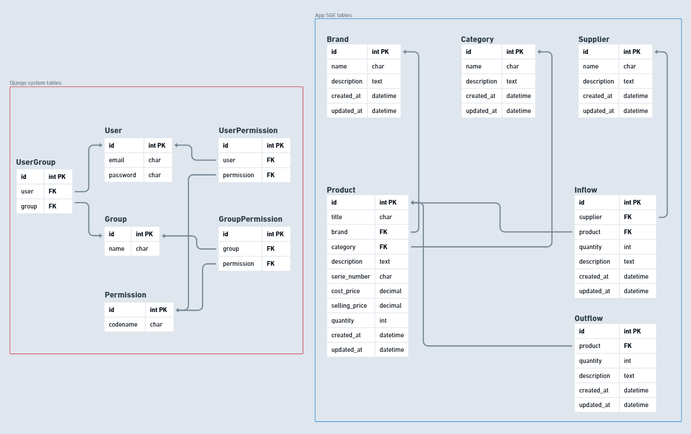

# 📦 Stock Management System

A robust and efficient system for total control of your inventory.

---

## ✨ Functional Requirements

The essential functionalities for managing your stock:

* **➕ Registration:**
    * Products (with details such as name, code, description, cost price, selling price, etc.)
    * Brands
    * Suppliers
    * Categories
    * Product Inflows (with date, quantity, supplier, etc.)
    * Product Outflows (with date, quantity, customer/reason, etc.)

* **🔍 Product Filters:**
    * Advanced search by name, code, brand, category, and other criteria.

* **📊 Automatic Stock Calculation:**
    * Real-time update of the available quantity of each product based on registered inflows and outflows.

* **🔑 Login System:**
    * Secure user authentication for system access.

* **🛡️ Permission Control:**
    * Permission management by user and/or group.
    * Implementation of different access levels to ensure data security and integrity.

* **📈 Dashboards and Metrics:**
    * Intuitive visual panels with key stock metrics.
    * Sales, inflows, outflows, and total stock value charts for a clear view of your business.

* **🔗 Future Integrations Support:**
    * Architecture designed to facilitate future integrations with other systems and automations.

---

# ⚙️ Project Installation

Follow these steps to set up and run the project on your local environment.

---

## 🛠️ Prerequisites

Ensure you have Python installed on your machine.

---

## 💾 Clone the Repository

1.  Create a directory on your computer where you want to install the project.
2.  Open your command-line terminal or command prompt inside this created directory.
3.  Execute the following command to clone the repository (replace `[REPOSITORY_URL]` with the actual Git repository URL):

    ```bash
    git clone [REPOSITORY_URL]
    ```

---

##  Virtual Environment

1.  Inside the cloned project directory, create an isolated Python virtual environment:

    ```bash
    python -m venv venv
    ```

2.  Activate the virtual environment:

    * **On Linux/macOS:**

        ```bash
        source venv/bin/activate
        ```

    * **On Windows:**

        ```bash
        .\venv\Scripts\activate
        ```

    (You will see the virtual environment name `(venv)` at the beginning of your command line, indicating it's active.)

---

## 📦 Install Dependencies

1.  With the virtual environment activated, navigate to the project directory (if you're not already there).
2.  Install all the necessary libraries and dependencies listed in the `requirements.txt` file:

    ```bash
    pip install -r requirements.txt
    ```

---

## ⚙️ Django Migrations

1.  Still in the terminal, run Django migrations to set up the database:

    ```bash
    python manage.py migrate
    ```

---

## 👤 Create Superuser

1.  Create an administrator account to access the Django admin panel:

    ```bash
    python manage.py createsuperuser
    ```

    You will be prompted to provide a username, email address, and password for the superuser.

---

## ⚙️ Environment Configuration (.env File)

Before running the application, it's recommended to configure the environment variables.

1.  **Rename `.env.copy` to `.env`:** In the project's root directory, you will find a file named `.env.copy`. Rename this file to `.env`.

2.  **Set the `DJANGO_SECRET_KEY`:** Open the `.env` file with a text editor. Locate the line for `DJANGO_SECRET_KEY` (it might be commented out or have a placeholder value). Replace the placeholder with a strong, randomly generated secret key for your Django application.

    ```
    DJANGO_SECRET_KEY=your_strong_and_secret_key_here
    ```

    **Important:** This `SECRET_KEY` is crucial for the security of your application. Do not share it publicly and ensure it is a long, random string.

    **Note:** If you do not rename the `.env.copy` file to `.env` and do not set the `DJANGO_SECRET_KEY` environment variable within it, the Django project's `settings.py` will fall back to using a default, insecure `SECRET_KEY`. **This is strongly discouraged for any environment beyond local development.**

---

## 🚀 Run the Server

1.  Start the Django development server:

    ```bash
    python manage.py runserver
    ```

    You will see a message indicating that the server is running at `http://127.0.0.1:8000/` or `http://localhost:8000/`.

---

## 🌐 Access the Admin in Browser

1.  Open your web browser.
2.  Navigate to the following address:

    ```
    http://localhost:8000/admin
    ```

3.  On the Django admin login page, enter the credentials (username and password) you created in the superuser step.

---

## 🚪 Access the System

1.  Using the same web browser, access the main system via the following URL:

    ```
    http://localhost:8000/
    ```

    You should be able to interact with the application using the user you created earlier (the superuser).

---

## ✅ Access Granted

Congratulations! You are now inside the management panel and the main system of your Django application.

---

## 🗺️ Application Routes

The available URLs to navigate and interact with the system:

### Administrative Pages

* `/admin/`: Django administration panel.
* `/login/`: Login page for system users.
* `/authentication/token/`: Endpoint to obtain a new authentication token.
* `/authentication/token/refresh/`: Endpoint to renew an existing authentication token.
* `/authentication/token/verify/`: Endpoint to verify the validity of an authentication token.
* `/home/`: System homepage after login.

### Brand Management

* `/brands/list/`: List of all brands.
* `/brands/create/`: Form to create a new brand.
* `/brands/<int:pk>/detail/`: Details of a specific brand (replace `<int:pk>` with the brand ID).
* `/brands/<int:pk>/update/`: Form to edit an existing brand.
* `/brands/<int:pk>/delete/`: Confirmation page to delete a brand.

### Category Management

* `/categories/list/`: List of all categories.
* `/categories/create/`: Form to create a new category.
* `/categories/<int:pk>/detail/`: Details of a specific category (replace `<int:pk>` with the category ID).
* `/categories/<int:pk>/update/`: Form to edit an existing category.
* `/categories/<int:pk>/delete/`: Confirmation page to delete a category.

### Inflow Management

* `/inflows/list/`: List of all product inflows.
* `/inflows/create/`: Form to register a new product inflow.
* `/inflows/<int:pk>/detail/`: Details of a specific inflow (replace `<int:pk>` with the inflow ID).

### Outflow Management

* `/outflows/list/`: List of all product outflows.
* `/outflows/<int:pk>/detail/`: Details of a specific outflow (replace `<int:pk>` with the outflow ID).

### Product Management

* `/products/list/`: List of all products.
* `/products/create/`: Form to create a new product.
* `/products/<int:pk>/detail/`: Details of a specific product (replace `<int:pk>` with the product ID).
* `/products/<int:pk>/update/`: Form to edit an existing product.
* `/products/<int:pk>/delete/`: Confirmation page to delete a product.

### Supplier Management

* `/suppliers/list/`: List of all suppliers.
* `/suppliers/create/`: Form to create a new supplier.
* `/suppliers/<int:pk>/detail/`: Details of a specific supplier (replace `<int:pk>` with the supplier ID).
* `/suppliers/<int:pk>/update/`: Form to edit an existing supplier.
* `/suppliers/<int:pk>/delete/`: Confirmation page to delete a supplier.

### RESTful API (Version 1)

#### Brands

* `/api/v1/brands/`: Endpoint to list and create brands (GET and POST methods).
* `/api/v1/brands/<int:pk>/`: Endpoint to retrieve, update, and delete a specific brand (GET, PUT, and DELETE methods).

#### Categories

* `/api/v1/categories/`: Endpoint to list and create categories (GET and POST methods).
* `/api/v1/categories/<int:pk>/`: Endpoint to retrieve, update, and delete a specific category (GET, PUT, and DELETE methods).

#### Inflows

* `/api/v1/inflows/`: Endpoint to list and create inflows (GET and POST methods).
* `/api/v1/inflows/<int:pk>/`: Endpoint to retrieve a specific inflow (GET method).

#### Outflows

* `/api/v1/outflows/`: Endpoint to list and create outflows (GET and POST methods).
* `/api/v1/outflows/<int:pk>/`: Endpoint to retrieve a specific outflow (GET method).

#### Products

* `/api/v1/products/`: Endpoint to list and create products (GET and POST methods).
* `/api/v1/products/<int:pk>/`: Endpoint to retrieve, update, and delete a specific product (GET, PUT, and DELETE methods).

#### Suppliers

* `/api/v1/suppliers/`: Endpoint to list and create suppliers (GET and POST methods).
* `/api/v1/suppliers/<int:pk>/`: Endpoint to retrieve, update, and delete a specific supplier (GET, PUT, and DELETE methods).

---

## 🖼️ System



---

## 📧 Contact

For more information, please contact:

tetigo@gmail.com
